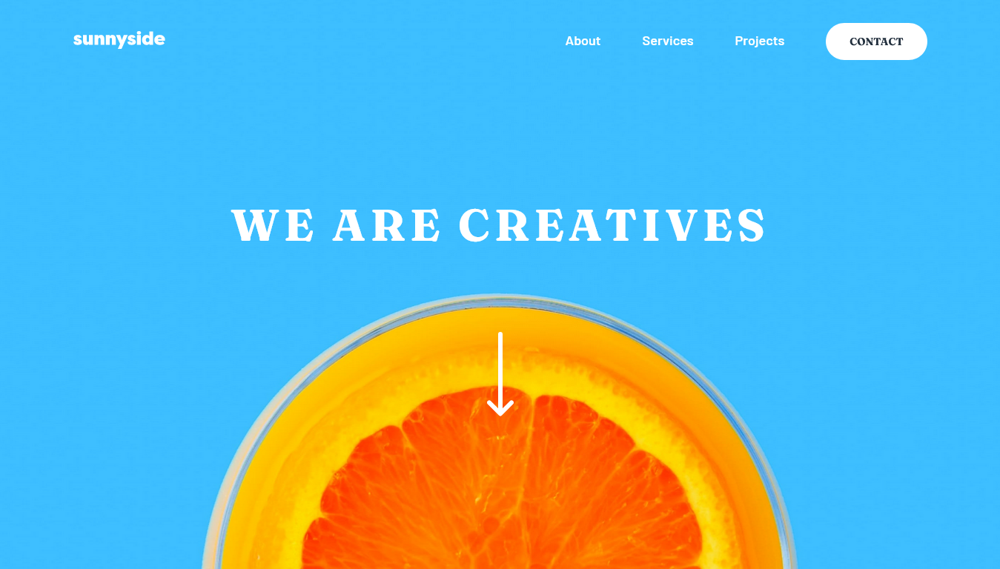

# Frontend Mentor - Sunnyside agency landing page solution

This is a solution to the [Sunnyside agency landing page challenge on Frontend Mentor](https://www.frontendmentor.io/challenges/sunnyside-agency-landing-page-7yVs3B6ef). Frontend Mentor challenges help you improve your coding skills by building realistic projects.

## Table of contents

- [Overview](#overview)
  - [The challenge](#the-challenge)
  - [Screenshot](#screenshot)
  - [Links](#links)
- [My process](#my-process)
  - [Built with](#built-with)
  - [What I learned](#what-i-learned)

## Overview

### The challenge

Users should be able to:

- View the optimal layout for the site depending on their device's screen size
- See hover states for all interactive elements on the page

### Screenshot

### Links

- Solution URL: [Github](https://github.com/Adel-Harrat/fm-junior-sunnyside-agency-landing-page)
- Live Site URL: [Vercel](https://fm-junior-sunnyside-agency-landing-page.vercel.app/)

## My process

### Built with

- Semantic HTML5 markup
- Flexbox
- CSS Grid
- Mobile-first workflow
- [React](https://reactjs.org/) - JS library
- [TailwindCSS](https://tailwindCSS/) - CSS framework

### What I learned

- I delved into the world of animation using the Framer Motion library, enabling me to create captivating and visually appealing animations. The ability to bring designs to life using Framer Motion has been an exciting and fulfilling experience.

- I explored the power of CSS and discovered how to create triangles using the Tailwind CSS framework. It's amusing to think that such geometric shapes can be effortlessly achieved with the right CSS techniques.

- Tailwind CSS has also proven useful in creating a cool border bottom effect, adding an extra touch of style and elegance to my web designs. I have come to appreciate the simplicity and flexibility offered by Tailwind CSS in achieving stunning visual effects.

- As I progressed, I realized the importance of organizing code and data effectively. By creating numerous variables to store data, I enhanced code readability and maintainability. This approach allowed me to easily locate and update information as needed, making my code more efficient.

- Furthermore, I honed my skills in organizing different parts of the website by leveraging the power of reusable React components. This approach significantly improved code modularity, allowing me to create scalable and flexible web applications. The ability to reuse components streamlined development and increased productivity.

These learnings have broadened my skillset and enriched my understanding of front-end development. I'm excited to continue exploring new technologies and techniques to further enhance my abilities in creating immersive and user-friendly web experiences.
